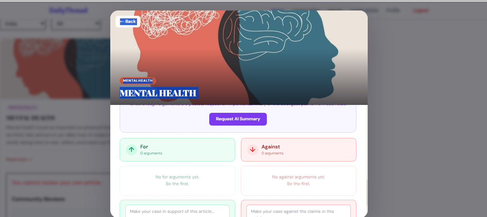
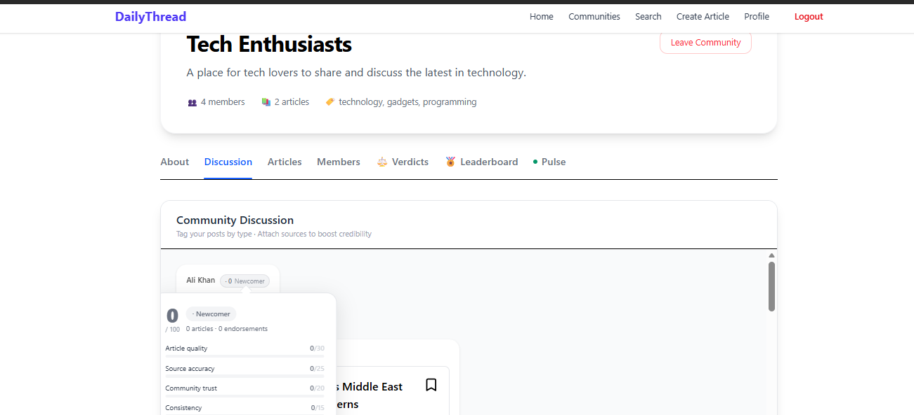

# 📰 DailyThread - News & Community Web App







**Live Frontend:** [https://dailythread-project-1.onrender.com](https://dailythread-project-1.onrender.com)  


---

## 🚀 Overview

**DailyThread** is a full-stack news and community web app built using the **MERN** stack. It combines API-generated top headlines with user-generated articles and adds a social layer through user profiles, saved articles, and interest-based communities.

---

## 🌐 Features

### 🏠 Home Page
- **Top Headlines:** Pulled from an external news API.
- **Top Articles:** Curated user-created articles.

### 🗞️ NewsFeed Page
- Users can:
  - **Search news** using keywords.
  - Explore **articles and headlines** by topic.
  - *(Note: Regional news functionality is under development.)*

### 🧑‍🤝‍🧑 Community Page
- **Search and follow users.**
- **Search or create communities** based on interests.
- Join communities to engage with like-minded users.
- **Create a Community** by adding:
  - Name
  - Description
  - Interest tags
  - Community rules

### ✍️ Create Article
- Users can post articles with:
  - Title
  - Content
  - Category
  -  source
  - Optional image


### 👤 Profile Page
- Edit name and bio.
- View all created articles.
- Access saved articles.

### 🔖 Article Interactions
- Save articles to your profile.
- Share articles in your joined communities.

---

## 🧰 Tech Stack

- **Frontend:** React + Vite + Tailwind CSS
- **Backend:** Node.js + Express + MongoDB
- **Authentication:** JWT + Cookies
- **File Uploads:** Cloudinary
- **Deployment:** Render

---

## 🧪 Features in Progress
- Regional news in NewsFeed.
- Improved mobile responsiveness.
- Notifications on community posts.


# DailyThread — Trusted News & Community Platform

**Live:** [https://dailythread-project-1.onrender.com](https://dailythread-project-1.onrender.com)

> *News you can actually trust.* DailyThread sits between Reddit and Medium — community-driven like the former, quality-focused like the latter — but with one thing neither has: **earned credibility**.

---

## Why DailyThread Exists

On Reddit, a person with zero track record can claim to have insider knowledge of a government scandal and get upvoted to the top. On news platforms, journalists won't call out powerful institutions. DailyThread fixes both problems.

Every user has a **credibility score** built from their publishing history, source accuracy, and peer trust. When you read a claim during a controversy — say, about food safety regulators or election results — you can immediately see whether the person making it has a history of being right, or is just loud. Communities can open **structured debates** and vote **verdicts** on disputed claims. The platform doesn't just surface content — it surfaces *accountable* content.

---

## Tech Stack

| Layer | Technology |
|---|---|
| Frontend | React 18 + Vite + Tailwind CSS |
| Backend | Node.js + Express |
| Database | MongoDB + Mongoose |
| Authentication | JWT + HTTP-only Cookies |
| File Uploads | Cloudinary (server-side via Multer + client-side direct) |
| AI / NLP | Groq API (llama-3.3-70b) · Sentiment.js |
| Deployment | Render (frontend + backend separate services) |

---

## Features

### News Feed

The feed pulls from an external news API and surfaces user-written articles side by side. Users can filter by category (Politics, Sports, Technology, Health, Finance, Education), region (India / International), or explore curated topic clusters. Mood-based filters — "Show me light news", "Show creative articles", "Show motivational news" — let users control tone, not just topic.

External articles link out to the original source. User articles open in a full article modal with reviews, comments, and debate.

---

### User Articles

Any user can write and publish articles with a title, content, category, region tags, source attribution, and an optional image. The article editor includes autocomplete for categories and tags.

Each article has three interaction layers below it: a star rating system, a threaded comment section, and a structured debate (see below).

When creating or editing an article, images are uploaded directly from the browser to Cloudinary — no backend involvement, no CORS issues.

---

### Credibility Score

Every user has a credibility score from 0 to 100, computed daily from five components:

| Component | Max points | How it's earned |
|---|---|---|
| Article quality | 30 | Average star rating across all published articles |
| Source accuracy | 25 | Proportion of articles that cite a verified source |
| Community trust | 20 | Total upvotes and peer endorsements received |
| Consistency | 15 | Regular posting cadence, no moderation flags |
| Debate quality | 10 | Net upvotes on debate arguments |

Scores map to five tiers: **Newcomer → Emerging → Contributor → Verified Voice → Authority**.

The score is visible everywhere a user appears — article cards, discussion messages, member lists, debate arguments. Clicking any score chip opens a breakdown popover. On a user's own profile, the Credibility tab shows the full arc, per-component bars, a "how to improve" section, and the points needed to reach the next tier.

On a public profile, instead of improvement tips, viewers see a plain-language trust statement: *"This is a Verified Voice with a proven track record. Their claims are generally reliable and well-cited."* That's the FSSAI scenario solved in the UI — you don't need to guess who to believe.

---

### Source Verification

When users post a discussion message, they can attach a source URL using the 📎 button in the send box. The backend checks the domain against a tiered allowlist covering 50+ Indian and international government sites, established news outlets, and fact-checking organisations.

Results are colour-coded inline on the message:

- ✅ Government / Academic Source
- 📰 Established News Outlet
- ❓ Unknown Source
- ⚠️ Flagged Source

Results are cached per domain for seven days. No external API cost — pure domain lookup with heuristic fallbacks for `.gov.in`, `.edu`, and `.ac.in` domains.

---

### Claim Tagging

Every discussion message can be tagged with a claim type before posting:

- 👤 **Personal Experience** — first-hand account
- 📎 **Cited Source** — backed by a URL
- 🔍 **Insider Claim** — claims insider knowledge
- 💬 **Opinion** — explicitly framed as opinion
- General — untagged

Tags appear on messages in the community discussion, making it immediately obvious what kind of claim is being made before readers even check the score.

---

### Debate Mode

Any article can be opened in Debate Mode from its full-article view. The comment section splits into two columns: **For** and **Against**. Users pick a side and post an argument — each argument shows the author's credibility score at the time of posting. Arguments are upvoted and downvoted independently.

An **AI Referee** button (powered by Groq's llama-3.3-70b) reads the top five arguments from each side and generates a neutral two-sentence summary of the strongest points from both. The summary is cached and can be refreshed. The AI is instructed to not take sides and to respond only in structured JSON.

---

### Community Verdicts

Community moderators can open a **Verdict** — a time-limited poll on a disputed claim. Members vote For or Against. Votes are **credibility-weighted**: an Authority-tier user's vote counts as 3, a Verified Voice as 2, a Contributor as 1.5, and a Newcomer as 1.

When the verdict closes (after 12, 24, or 48 hours, or manually), the result is computed and pinned: *"Community ruled: Claims unverified — 67% disagreed."* An AI-generated one-sentence neutral summary explains what the verdict means for readers. The result stays pinned on the community's Verdicts tab permanently.

---

### Community Pulse

Each community has a **Pulse** tab showing live sentiment computed from recent posts and comments using NLP. The current mood is displayed as a large emoji + label (Euphoric, Optimistic, Hopeful, Neutral, Tense, Upset, Outraged) with a 0–100 score.

Below the hero, a sparkline shows how sentiment shifted over the last 12 hours in 30-minute intervals. Trending positive and negative words are extracted and displayed. A full sentiment breakdown shows percentage splits across five sentiment bands. The panel auto-refreshes every 30 seconds.

---

### Community Leaderboard

The **Leaderboard** tab ranks the top 10 most trusted community members this week by credibility score, with weekly article count as a tiebreaker. Gold, silver, and bronze medals for the top three. Clicking any entry navigates to that user's public profile. Moderators can force-refresh the cache.

---

### Communities

Users can create communities with a name, description, interest tags, and rules. The community detail page has seven tabs: About, Discussion, Articles, Members, Verdicts, Leaderboard, and Pulse.

Community management features include joining and leaving, inviting members, promoting and removing moderators, kicking members, and transferring ownership. All moderation actions are role-gated (owner vs moderator vs member).

The Discussion tab functions as a real-time community chat. Members can share articles directly into the discussion from the Articles tab. Non-members see a blur overlay on restricted content with a join prompt.

---

### Profiles

**Own profile** has five tabs: Credibility (full score breakdown with improvement tips), Achievements (8 unlockable badges), Activity (unified timeline of articles, debates, verdicts, and communities), Articles, and Saved. The credibility score and tier appear inline under the user's name at all times.

**Public profiles** show the same tabs but replace improvement tips with a reader-facing trust statement. A follow/unfollow button is wired with optimistic UI. Stats include credibility score, endorsements, followers, and following alongside the standard counts.

---

### Achievements

Eight badges that unlock based on real activity and credibility data:

| Badge | Condition |
|---|---|
| ✍️ First Article | Published first article |
| 📚 5 Articles | Published 5 articles |
| ✦ Trusted | Reached Verified Voice tier (70+) |
| 📎 Source Champ | Near-full source accuracy score |
| 🔥 Consistent | Near-full consistency score |
| ⚖️ Debater | Earned debate score points |
| ◆ Authority | Reached Authority tier (85+) |
| ❤️ Community Loved | 20+ peer endorsements |

Locked badges appear greyed out on public profiles so visitors can see what a user has and hasn't earned.

---

### Article Reviews & Discussions

Below every user article: a star rating component and a threaded comment/discussion section. Both are accessible from the article card and from the full article modal. The modal also surfaces the Debate tab alongside Comments so users can switch between structured and unstructured engagement.

---

### Authentication

Email and password sign up and sign in with JWT stored in HTTP-only cookies. The sign-in page uses a split-screen layout — the left panel explains DailyThread's credibility thesis and feature set; the right panel is the form. Form fields animate in with staggered delays when switching between sign-in and sign-up modes.

---

## Project Structure

```
client/
  src/
    components/
      ArticleCard.jsx          # Article card with author info, credibility chip, category pill
      ArticleDetails.jsx       # Full article modal with hero image, author card, debate/comments tabs
      ArticleEditModal.jsx     # Edit article with inline Cloudinary upload
      ArticleReview.jsx        # Star rating component
      ArticleDiscussion.jsx    # Threaded comment section
      LoadingSpinner.jsx
    pages/
      SignInForm.jsx            # Split-screen auth page
      NewsFeedPage.jsx          # Headlines, articles, regional, topics tabs + mood filters
      CreateArticle.jsx         # Article creation form
      CommunityDetailPage.jsx   # 7-tab community page with all new features
      ProfilePage.jsx           # Own profile with credibility, achievements, activity
      PublicProfilePage.jsx     # Public profile with trust statement + follow button
      DebateMode.jsx            # FOR/AGAINST debate with AI referee
    Context/
      UserContext.jsx

server/
  controllers/
    credibilityController.js   # Score computation + 24h cache
    debateController.js        # Debate CRUD + Groq AI summarization
    discussionController.js    # Community chat with claim tagging + source verification
    verdictController.js       # Verdict lifecycle + credibility-weighted voting
    leaderboardController.js   # Weekly leaderboard + hourly cache
    sourceVerificationController.js  # Domain tier lookup + 7-day cache
    activityController.js      # Unified activity feed + follow/unfollow
    profileController.js       # Profile photo upload/delete via Multer + Cloudinary
  models/
    User.js  Article.js  Community.js
    CredibilityScore.js  DebateArgument.js  DebateSummary.js
    CommunityVerdict.js  Leaderboard.js  SourceVerification.js
    Discussion.js
  routes/
    auth.js  article.js  profile.js  community.js
    credibility.js  debate.js  discussion.js  verdict.js
    leaderboard.js  sourceVerification.js  activity.js
  middleware/
    requireAuth.js
  server.js
```


## What's Next

Real-time discussion updates via WebSockets so new community messages appear without a page refresh. Push notifications (Web Push API) for community activity and verdict results. A PWA wrapper for installability and offline reading of saved articles. Semantic search across articles using vector embeddings.